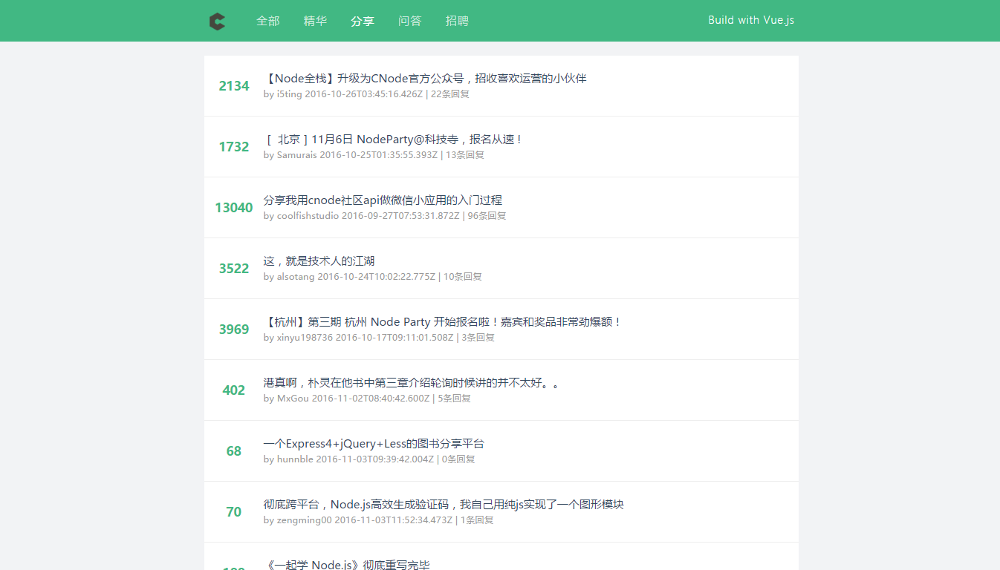

# Vue-CNode

Vue 版 CNode 社区

> UI 参考 vue-hackernews-2.0



## Build Setup

``` bash
# install dependencies
npm install

# serve with hot reload at localhost:8080
npm run dev

# build for production with minification
npm run build
```